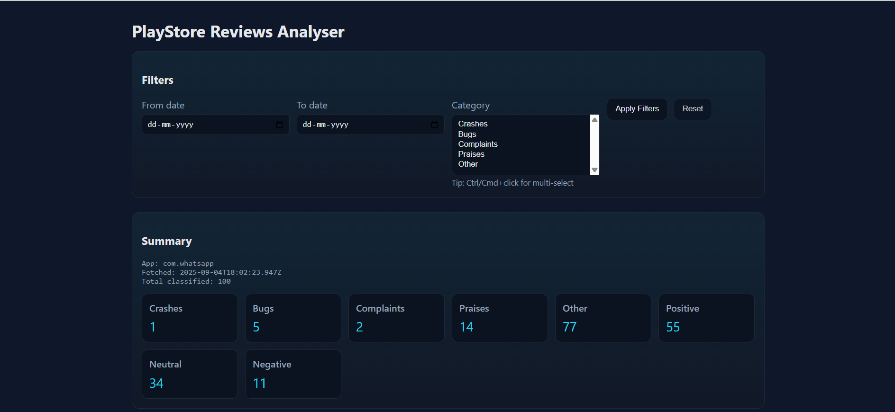
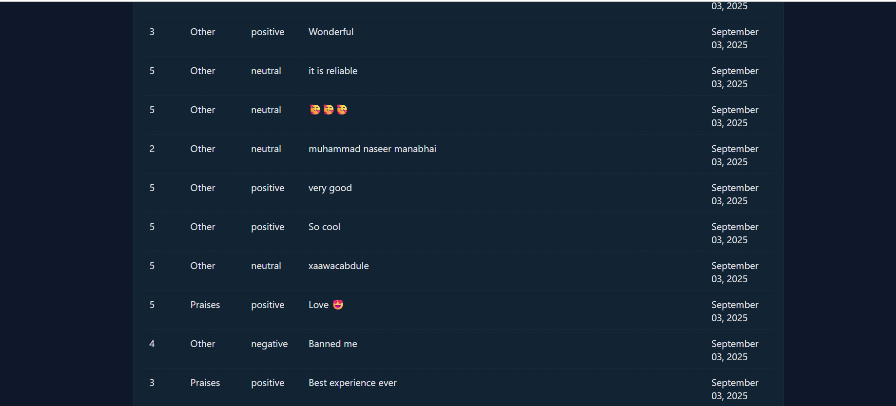
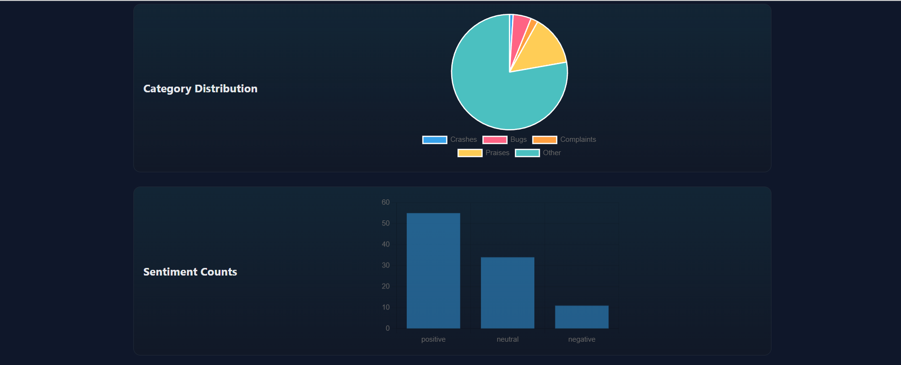
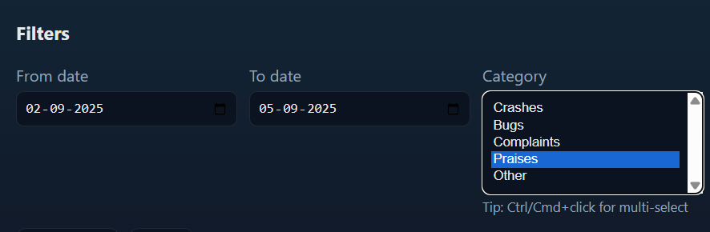

# PlayStore Reviews Analyser

A web application that scrapes reviews from the Google Play Store for any app (via SerpAPI), classifies them into categories, performs sentiment analysis, and displays the results on a Flask-powered web dashboard.

---

## Features

- Scraping (Node.js / SerpAPI)  
  - Fetches reviews for any Google Play app using its product id.  
  - Stores results in `reviews/fetch.json`.  
  - Skips fetching if data already exists for today (use `--force` to override).

- Classification (Python / NLTK VADER)  
  - Categories: Crashes, Bugs, Complaints, Praises, Other  
  - Sentiment analysis: Positive, Neutral, Negative  
  - Saves classified results into `reviews/classified_reviews.json`.

- Flask Web Dashboard  
  - Summary statistics (counts per category and sentiment).  
  - Interactive charts (Category Pie, Sentiment Bar).  
  - Filters: by date and by category.  
  - Full table of reviews with rating, category, sentiment, text, and date.

---

## Project Structure

```
PLAY_REVIEWS/
├─ backend/
│  └─ classify_reviews.py
├─ scraper/
│  └─ scrape_reviews.js
├─ web/
│  ├─ templates/
│  │  └─ index.html
│  └─ static/
│     ├─ styles.css
│     └─ app.js
├─ reviews/                 # generated JSON files
│  ├─ fetch.json
│  └─ classified_reviews.json
├─ script.py                 # orchestrator + Flask server
├─ requirements.txt
├─ package.json
├─ .env.example
└─ README.md
```

---

## Setup Instructions

### 1. Prerequisites
- Python 3.8+
- Node.js 16+
- A [SerpAPI](https://serpapi.com) API key (free account works)

### 2. Clone or unzip the project
```bash
cd PLAY_REVIEWS
```

### 3. Python setup
```bash
python -m venv .venv
# Windows:
.venv\Scripts\Activate
# macOS/Linux:
source .venv/bin/activate

pip install -r requirements.txt
```

### 4. Node.js setup
```bash
npm install
```

### 5. Configure environment
Copy `.env.example` to `.env` and set:
```
SERPAPI_KEY=your_real_key_here
PRODUCT_ID=com.whatsapp
```

- `SERPAPI_KEY` → your SerpAPI key from the dashboard  
- `PRODUCT_ID` → Play Store app id (e.g., `com.instagram.android`)

### 6. Run the project
```bash
python script.py --force
```

- `--force` ensures fresh fetch even if `fetch.json` already exists today.  
- Server starts on http://localhost:5000

---

## Usage Guide

- Change app: edit `PRODUCT_ID` in `.env` and run again with `--force`.  
- Daily run (reuse today’s data):
  ```bash
  python script.py
  ```
- Force fresh scrape (same day or after changing app):
  ```bash
  python script.py --force
  ```

Generated files:
- Raw reviews → `reviews/fetch.json`  
- Classified reviews → `reviews/classified_reviews.json`

---

## Dashboard Features

- Summary of total reviews, categories, and sentiment.  
- Category Pie chart and Sentiment Bar chart.  
- Filters: by date range and by category.  
- Reviews table (rating, category, sentiment, text, date).

---

## Notes

- Free SerpAPI accounts have a request quota (100 searches/month). Use `--force` carefully.  
- VADER sentiment lexicon downloads automatically the first time you run.  
- This Flask server is for development only (not for production use).  

---
## Demo Video

[Watch the demo](demo.mp4)
## Demo Screenshot






## License

MIT License
